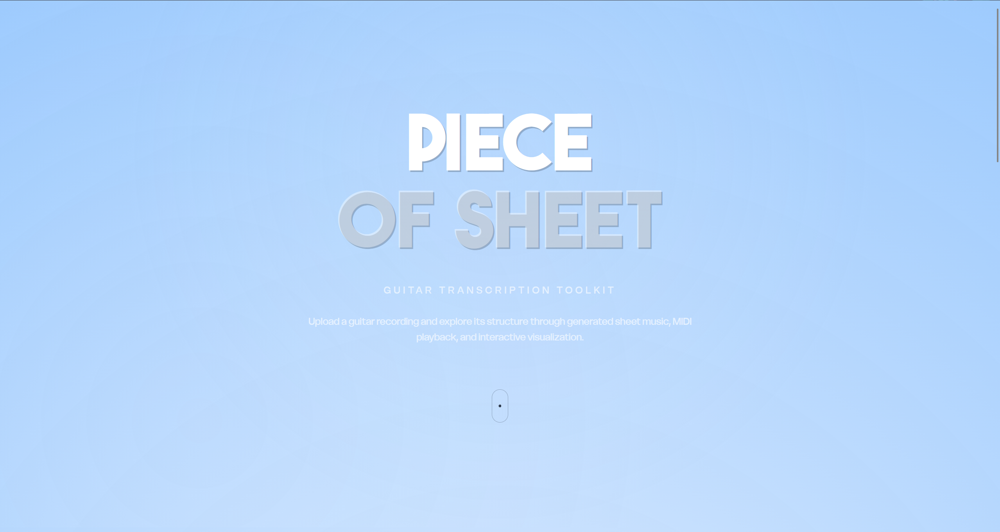
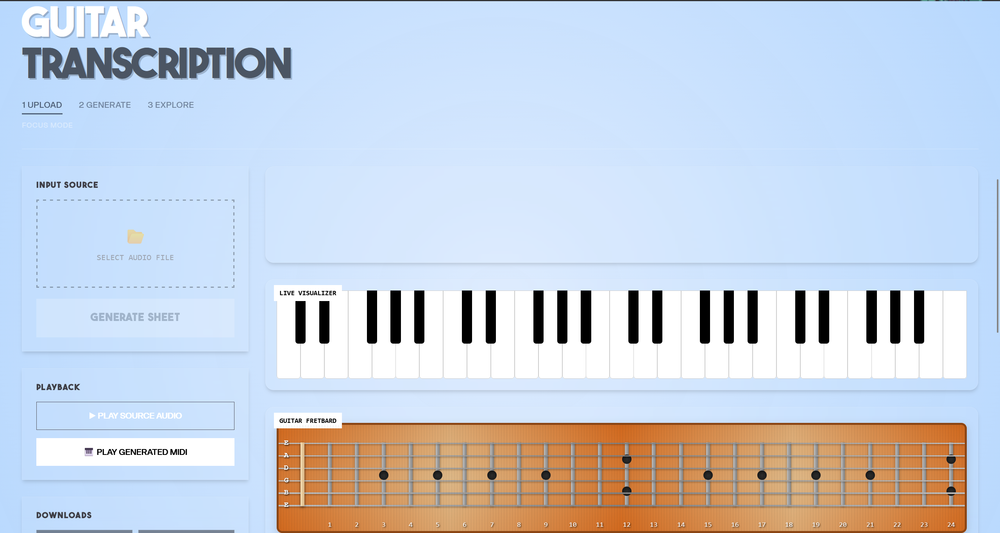
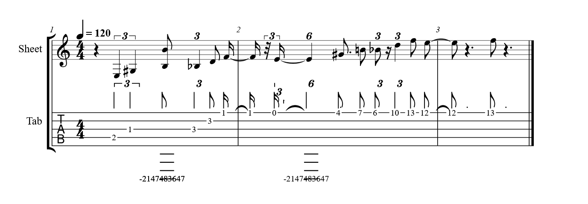
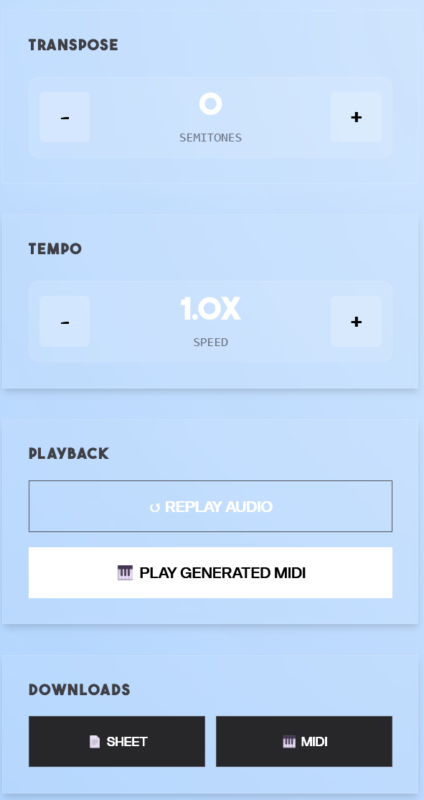

```
__________.__                              _____       
\______   \__| ____   ____  ____          /  _  \_____ 
 |     ___/  |/ __ \_/ ___\/ __ \        /  /_\  \__  \
 |    |   |  \  ___/\  \__\  ___/       /    |    \/ __ \_
 |____|   |__|\___  >\___  >___  >______\____|__  (____  /
                  \/     \/    \/ /_____/       \/     \/
  _________.__                  __   
 /   _____/|  |__   ____   ____/  |_ 
 \_____  \ |  |  \_/ __ \_/ __ \   __\
 /        \|   Y  \  ___/\  ___/|  |  
/_______  /|___|  /\___  >\___  >__|  
        \/      \/     \/     \/
```

<b>Piece of Sheet</b> is a web-based automated music transcription tool designed to bridge the gap between acoustic performance and written notation. By leveraging Spotify's machine learning models and robust music theory libraries, it converts raw audio files into interactive sheet music in seconds.

<h2>Key Features</h2>

- <b>Audio Ingestion:</b> Supports upload of standard .wav files (only guitar related audio).

- <b>AI-Powered Transcription:</b> Utilizes <a href="https://github.com/spotify/basic-pitch">Spotify's Basic Pitch</a>, a lightweight neural network for high-accuracy audio-to-MIDI conversion.
  
- <b>MusicXML Standardization:</b> Robust processing via <a href="https://github.com/cuthbertLab/music21">Music21</a> to quantize MIDI data and convert it into the industry-standard MusicXML format.

- <b>Interactive Rendering:</b> Real-time sheet music and guitar tablulature rendered using <a href="https://github.com/rism-digital/verovio">Verovio</a>, allowing users to view notation directly in the browser without external software.
  
- <b>Web Interface:</b> Clean, responsive UI built with HTML5, CSS3, and JavaScript. It also contains a piano and guitar visualization window, that play the notes. There also an export option which allows you to download .midi and .xml files which are generated.
  

<h2>Pipeline Visualization</h2>
<div align="center">
  
  <br>
  </div>


<h2>Installation Guide</h2>
  
- clone repository or download the entire repository.

- use 'requirements.txt' to download all the necessary libraries in a virtual environment

<h2>Project Demo</h2>

<h3>product page</h3>
<div align="center">
  
  <br>
  </div>

<h3>workstation</h3>
<div align="center">
  
  <br>
  </div>
 
<h3>audio upload and playback</h3>

https://github.com/user-attachments/assets/a529f903-c0c1-43f5-a2be-cfc737a78d1c

<h3>piano playback visualization</h3>

https://github.com/user-attachments/assets/ecbb1778-4045-4418-8ffe-44024b0eb781

<h3>guitar playback visualization</h3>

https://github.com/user-attachments/assets/a378beaf-3580-4fe0-814d-2eb5408bb73b

<h3>sheet notation</h3>
<div align="center">
  
  <br>
  </div>

<h3>tools</h3>
<div align="left">
  
  <br>
  </div>
  
