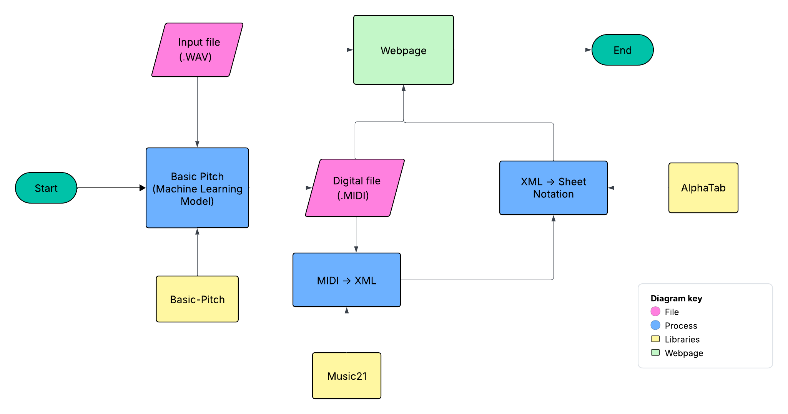
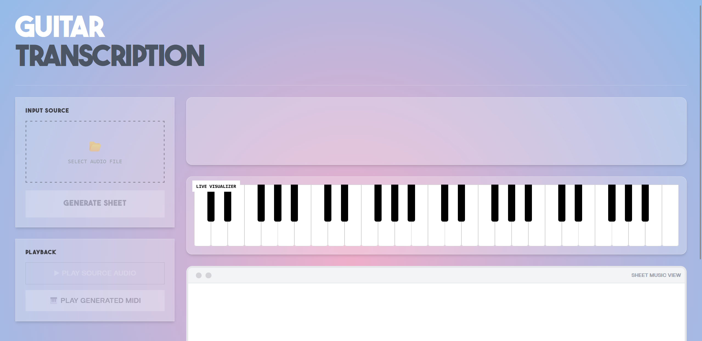
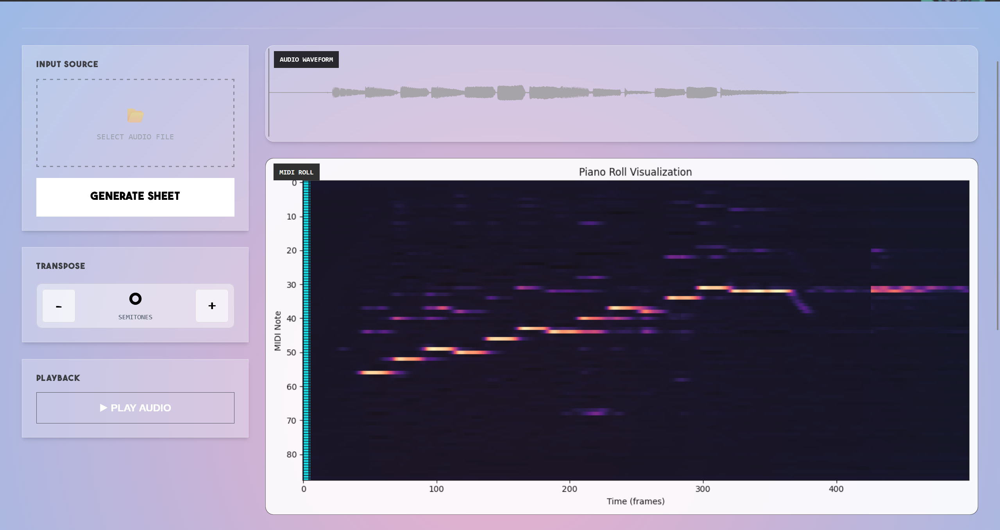
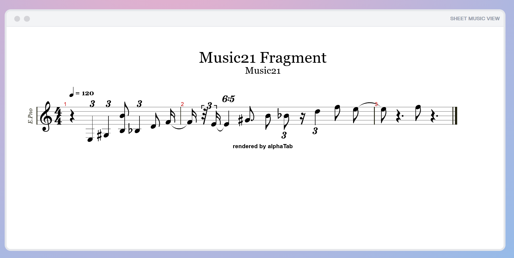

```
__________.__                              _____       
\______   \__| ____   ____  ____          /  _  \_____ 
 |     ___/  |/ __ \_/ ___\/ __ \        /  /_\  \__  \
 |    |   |  \  ___/\  \__\  ___/       /    |    \/ __ \_
 |____|   |__|\___  >\___  >___  >______\____|__  (____  /
                  \/     \/    \/ /_____/       \/     \/
  _________.__                  __   
 /   _____/|  |__   ____   ____/  |_ 
 \_____  \ |  |  \_/ __ \_/ __ \   __\
 /        \|   Y  \  ___/\  ___/|  |  
/_______  /|___|  /\___  >\___  >__|  
        \/      \/     \/     \/
```

<b>Piece of Sheet</b> is a web-based automated music transcription tool designed to bridge the gap between acoustic performance and written notation. By leveraging <a href="https://github.com/spotify/basic-pitch">Spotify's</a> machine learning models and robust music theory libraries, it converts raw audio files into interactive sheet music in seconds.

<h2>Key Features</h2>

- <b>Audio Ingestion:</b> Supports upload of standard .wav files (we mostly work with guitar).

- <b>AI-Powered Transcription:</b> Utilizes <b>Spotify's Basic Pitch</b> lightweight neural network for high-accuracy audio-to-MIDI conversion.
  
- <b>MusicXML Standardization:</b> Robust processing via <b>Music21</b> to quantize MIDI data and convert it into the industry-standard MusicXML format.

- <b>Interactive Rendering:</b> Real-time sheet music display using <b>AlphaTab</b>, allowing users to view notation directly in the browser without external software.
  
- <b>Web Interface:</b> Clean, responsive UI built with HTML5, CSS3, and JavaScript.
  

<h2>Pipeline Visualization</h2>
<div align="center">
  
  <br>
  </div>


<h2>Installation Guide</h2>
  
- clone repository or download the entire repository.

- use 'requirements.txt' in .venv/ to download all the necessary libraries in a virtual environment

<h2>Project Demo</h2>

<div align="center">
  
  <br>
  </div>
  
<div align="center">
  
  <br>
  </div>
  
<div align="center">
  
  <br>
  </div>
 
